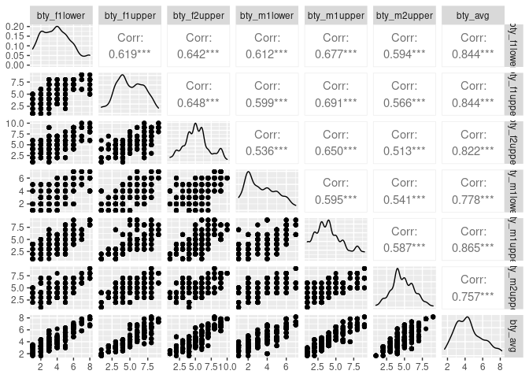

Activity 4
================

# Day 1 - Activity 4

## Task 2: Load the necessary packages

``` r
suppressPackageStartupMessages(library(tidyverse))
suppressPackageStartupMessages(library(tidymodels))
suppressPackageStartupMessages(library(GGally))
suppressPackageStartupMessages(library(ggfortify))
```

## Task 3: Load the data

``` r
evals<-read_tsv("https://www.openintro.org/data/tab-delimited/evals.txt",show_col_types = FALSE)
```

1.  This is an experimental study for me because the data was collected
    from students to test the hypothesis whether beauty leads directly
    to affect the score evaluations. We can answer the question if it
    phrased as whether or not beauty affects the score evaluations.

``` r
plot1<-evals%>%ggplot(aes(x=score))+
  geom_histogram(fill="red",color="black",bins = 30)+
  labs(title = "Distribution of Score")+
  theme(plot.title = element_text(hjust = 0.5))
plot1
```

<!-- -->

2.  The distribution of the variable “Score” appears to be Left-skewed.
    It indicates that the majority of students gave the professors a
    more than average rating. It is not what I expected; I expected it
    to be slightly right-skewed.

3.  I chose the variables gender and bty avg to show their relationship.
    I chose a box plot to visualize their relationship, and the below
    visualization shows that female professors have a slightly higher
    average beauty score than male professors.

``` r
plot2<-evals%>%ggplot(aes(x=gender,y=bty_avg,fill=gender))+
  geom_boxplot()+
  labs(title = "Relationship between Gender and Beauty Average",
       x="Gender of the Professor",
       y="Beauty average score")+
  theme(plot.title = element_text(hjust = 0.5))

plot2
```

<!-- -->

## Task 4: Pairwise relationships

``` r
evals_bty<-select(evals,c("bty_f1lower","bty_f1upper","bty_f2upper","bty_m1lower","bty_m1upper","bty_m2upper","bty_avg"))

evals_ggpairs<-evals_bty %>% ggpairs()

evals_ggpairs
```

<!-- -->

4.  

-   bty\_avg has a higher correlation with rest of the beauty variables
    and positively linear relation with bty\_m1upper

-   bty\_f1lower has the highest correlation with bty\_avg and
    bty\_m1upper

-   bty\_f1upper has the highest correlation with bty\_avg and
    bty\_m1upper

-   bty\_f2upper has positive linear relationship with bty\_avg

-   bty\_m1lower has positive linear relationship with bty\_avg

-   bty\_m1upper has positive linear relationship with bty\_avg

-   bty\_m2upper has positive linear relationship with bty\_avg

5.  I don’t think it makes sense to include all the variables in the
    model, because it would be a complex model with many variables.

6.  I think including bty\_avg variable in the model will be a good
    decision since it has a positive linear relationship with all other
    beauty variables.

## Task 5: Multiple linear regression: one quantitative predictor, one qualitative predictor

``` r
m_bty_gen <- lm(score ~ bty_avg+gender, data = evals)
tidy(m_bty_gen)
```

    ## # A tibble: 3 × 5
    ##   term        estimate std.error statistic   p.value
    ##   <chr>          <dbl>     <dbl>     <dbl>     <dbl>
    ## 1 (Intercept)   3.75      0.0847     44.3  6.23e-168
    ## 2 bty_avg       0.0742    0.0163      4.56 6.48e-  6
    ## 3 gendermale    0.172     0.0502      3.43 6.52e-  4

``` r
# Creating the diagnostic plots using the function plot() from ggfortify package 
par(mfrow = c(2, 2))
plot(m_bty_gen)
```

<!-- -->

7.  From the above diagnostic plots we can see that

    -   The linear relationship assumption is met very well as the
        residual vs fitted plot does not follow any particular patter
        and spread randomly
    -   The normality assumption has met satisfactorily as the residuals
        follow along the line in q-q plot
    -   The constant variance assumption also met reasonably as the
        residuals spread is equal along the horizantal line

8.  The bty\_avg looks like a significant predictor of the score. The
    addition of gender has changed the parameter estimate of bty\_avg
    from 3.88 to 3.75.

9.  

$$
  \begin{aligned}
\widehat{\texttt{score}} &= \hat{\beta}_0 + \hat{\beta}_1 \times \texttt{bty\\_avg} + \hat{\beta}_2 \times (1) \\
&= \hat{\beta}_0 + \hat{\beta}_1 \times \texttt{bty\\_avg}+ \hat{\beta}_2
\end{aligned}
$$

10. For two genders received the same beauty avg score, The male
    professors are likely to receive a higher course evaluation score.

``` r
# Model to predict the score with help of bty_avg and rank

m_bty_rank<-lm(score ~ bty_avg+rank, data = evals)
tidy(m_bty_rank)
```

    ## # A tibble: 4 × 5
    ##   term             estimate std.error statistic   p.value
    ##   <chr>               <dbl>     <dbl>     <dbl>     <dbl>
    ## 1 (Intercept)        3.98      0.0908     43.9  2.92e-166
    ## 2 bty_avg            0.0678    0.0165      4.10 4.92e-  5
    ## 3 ranktenure track  -0.161     0.0740     -2.17 3.03e-  2
    ## 4 ranktenured       -0.126     0.0627     -2.01 4.45e-  2

11. R appears to handle categorical variables with more than 2 levels by
    removing one level from the total number of levels. Here since there
    are 3 levels, R is using only 2 of them by removing teaching and
    recodes the levels by creating a contrast matrix.

-   If Rank is tenure track then the ranktenure track is coded as 1 and
    ranktenured as 0.
-   If Rank is tenured then the ranktenure track is coded as 0 and
    ranktenured as 1.
-   If Rank is teaching then both the ranktenure track and ranktenured
    are coded as 0.

# Activity 4 - Day 2

## Task 2: bty\_avg \* gender interaction

``` r
# model predicting score with help of bty_avg, gender and their interaction

m_int <- lm(score ~ bty_avg * gender, data = evals)
tidy(m_int)
```

    ## # A tibble: 4 × 5
    ##   term               estimate std.error statistic   p.value
    ##   <chr>                 <dbl>     <dbl>     <dbl>     <dbl>
    ## 1 (Intercept)          3.95      0.118      33.5  2.92e-125
    ## 2 bty_avg              0.0306    0.0240      1.28 2.02e-  1
    ## 3 gendermale          -0.184     0.153      -1.20 2.32e-  1
    ## 4 bty_avg:gendermale   0.0796    0.0325      2.45 1.46e-  2

1.  Since R recodes the categorical variable into a indicator variable
    of binary values. Here, the gender variale is recoded as gendermale
    which takes value ‘0’ for female and ‘1’ for male professors. The
    interaction of bty\_avg and gender is bty\_avg:gendermale.

2a) For Male professors

$$
\begin{aligned}
\widehat{\texttt{score}} &= \hat{\beta}_0 + \hat{\beta}_1 \times \texttt{bty\\_avg} + \hat{\beta}_2 \times \texttt{gendermale}+ \hat{\beta}_3 \times \texttt{bty\\_avg:gendermale} \\
&= \hat{\beta}_0 + \hat{\beta}_1 \times \texttt{bty\\_avg} + \hat{\beta}_2 \times (1)+ \hat{\beta}_3 \times \texttt{bty\\_avg:gendermale} \\
&= \hat{\beta}_0 + \hat{\beta}_1 \times \texttt{bty\\_avg}+ \hat{\beta}_2 + \hat{\beta}_3 \times \texttt{bty\\_avg:gendermale}
\end{aligned}
$$

2b) For Female Professors

$$
\begin{aligned}
\widehat{\texttt{score}} &= \hat{\beta}_0 + \hat{\beta}_1 \times \texttt{bty\\_avg} + \hat{\beta}_2 \times \texttt{gendermale}+ \hat{\beta}_3 \times \texttt{bty\\_avg:gendermale} \\
&= \hat{\beta}_0 + \hat{\beta}_1 \times \texttt{bty\\_avg} + \hat{\beta}_2 \times (0)+ \hat{\beta}_3 \times \texttt{bty\\_avg:gendermale} \\
&= \hat{\beta}_0 + \hat{\beta}_1 \times \texttt{bty\\_avg}+ \hat{\beta}_3 \times \texttt{bty\\_avg:gendermale}
\end{aligned}
$$

3.  When two professors who received the same beauty rating, the male
    professors tends to have the higher course evaluation score

``` r
# checking the model fitof m_int and m_bty_gen

glance(m_int)
```

    ## # A tibble: 1 × 12
    ##   r.squ…¹ adj.r…² sigma stati…³ p.value    df logLik   AIC   BIC devia…⁴ df.re…⁵
    ##     <dbl>   <dbl> <dbl>   <dbl>   <dbl> <dbl>  <dbl> <dbl> <dbl>   <dbl>   <int>
    ## 1  0.0713  0.0652 0.526    11.7 2.00e-7     3  -357.  725.  745.    127.     459
    ## # … with 1 more variable: nobs <int>, and abbreviated variable names
    ## #   ¹​r.squared, ²​adj.r.squared, ³​statistic, ⁴​deviance, ⁵​df.residual

``` r
glance(m_bty_gen)
```

    ## # A tibble: 1 × 12
    ##   r.squ…¹ adj.r…² sigma stati…³ p.value    df logLik   AIC   BIC devia…⁴ df.re…⁵
    ##     <dbl>   <dbl> <dbl>   <dbl>   <dbl> <dbl>  <dbl> <dbl> <dbl>   <dbl>   <int>
    ## 1  0.0591  0.0550 0.529    14.5 8.18e-7     2  -360.  729.  745.    129.     460
    ## # … with 1 more variable: nobs <int>, and abbreviated variable names
    ## #   ¹​r.squared, ²​adj.r.squared, ³​statistic, ⁴​deviance, ⁵​df.residual

4.  The interaction model is performing better than the model with jus
    the variables. I used the R-squared value and p-value to compare the
    model fit of both the models because the R-squared value tells us
    variance explained byeach model to predict the evaluation score.

## Task 3: bty\_avg \* rank interaction

``` r
m_int_rank <- lm(score ~ bty_avg * rank, data = evals)
tidy(m_int_rank)
```

    ## # A tibble: 6 × 5
    ##   term                     estimate std.error statistic  p.value
    ##   <chr>                       <dbl>     <dbl>     <dbl>    <dbl>
    ## 1 (Intercept)                4.10      0.150    27.4    1.80e-98
    ## 2 bty_avg                    0.0417    0.0314    1.33   1.84e- 1
    ## 3 ranktenure track          -0.0188    0.230    -0.0818 9.35e- 1
    ## 4 ranktenured               -0.409     0.182    -2.25   2.52e- 2
    ## 5 bty_avg:ranktenure track  -0.0264    0.0463   -0.570  5.69e- 1
    ## 6 bty_avg:ranktenured        0.0659    0.0392    1.68   9.38e- 2

In this model since there are more than two levels in the categorical
variable rank, r has recoded it to two variables by creating a contrast
matrix and the same in the interaction of those two with the bty\_avg
variable. So, we have two interaction variables. Below here is how the
model looks based on their ranks respectively

1.  How the model looks irrespective of Rank

$$
\widehat{\texttt{score}} = \hat{\beta}_0 + \hat{\beta}_1 \times \texttt{bty\\_avg} + \hat{\beta}_2 \times \texttt{ranktenure track}+ \hat{\beta}_3 \times \texttt{ranktenured} + \hat{\beta}_4 \times \texttt{bty_avg:ranktenure track}+ \hat{\beta}_5 \times \texttt{bty_avg:ranktenured}
$$

2.  If Rank of the professor is tenure track

$$
\begin{aligned}
\widehat{\texttt{score}} &= \hat{\beta}_0 + \hat{\beta}_1 \times \texttt{bty\\_avg} + \hat{\beta}_2 \times \texttt{ranktenuretrack}+ \hat{\beta}_3 \times \texttt{ranktenured}+ \hat{\beta}_4 \times \texttt{bty_avg:ranktenuretrack}+ \hat{\beta}_5 \times \texttt{bty_avg:ranktenured} \\
&= \hat{\beta}_0 + \hat{\beta}_1 \times \texttt{bty\\_avg} + \hat{\beta}_2 \times (1)+ \hat{\beta}_3 \times (0)+ \hat{\beta}_4 \times \texttt{bty_avg:ranktenuretrack}+ \hat{\beta}_5 \times \texttt{bty_avg:ranktenured} \\
&= \hat{\beta}_0 + \hat{\beta}_1 \times \texttt{bty\\_avg} + \hat{\beta}_2 + \hat{\beta}_4 \times \texttt{bty_avg:ranktenuretrack}+ \hat{\beta}_5 \times \texttt{bty_avg:ranktenured}
\end{aligned}
$$

3.  If Rank of the professor is tenured

$$
\begin{aligned}
\widehat{\texttt{score}} &= \hat{\beta}_0 + \hat{\beta}_1 \times \texttt{bty\\_avg} + \hat{\beta}_2 \times \texttt{ranktenure track}+ \hat{\beta}_3 \times \texttt{ranktenured}+ \hat{\beta}_4 \times \texttt{bty_avg:ranktenure track}+ \hat{\beta}_5 \times \texttt{bty_avg:ranktenured} \\
&= \hat{\beta}_0 + \hat{\beta}_1 \times \texttt{bty\\_avg} + \hat{\beta}_2 \times (0)+ \hat{\beta}_3 \times (1)+ \hat{\beta}_4 \times \texttt{bty_avg:ranktenure track}+ \hat{\beta}_5 \times \texttt{bty_avg:ranktenured} \\
&= \hat{\beta}_0 + \hat{\beta}_1 \times \texttt{bty\\_avg} + \hat{\beta}_3 + \hat{\beta}_4 \times \texttt{bty_avg:ranktenure track}+ \hat{\beta}_5 \times \texttt{bty_avg:ranktenured}
\end{aligned}
$$

4.  If Rank of the professor is teaching

$$
\begin{aligned}
\widehat{\texttt{score}} &= \hat{\beta}_0 + \hat{\beta}_1 \times \texttt{bty\\_avg} + \hat{\beta}_2 \times \texttt{ranktenure track}+ \hat{\beta}_3 \times \texttt{ranktenured}+ \hat{\beta}_4 \times \texttt{bty_avg:ranktenure track}+ \hat{\beta}_5 \times \texttt{bty_avg:ranktenured} \\
&= \hat{\beta}_0 + \hat{\beta}_1 \times \texttt{bty\\_avg} + \hat{\beta}_2 \times (0)+ \hat{\beta}_3 \times (0)+ \hat{\beta}_4 \times \texttt{bty_avg:ranktenure track}+ \hat{\beta}_5 \times \texttt{bty_avg:ranktenured} \\
&= \hat{\beta}_0 + \hat{\beta}_1 \times \texttt{bty\\_avg} + \hat{\beta}_4 \times \texttt{bty_avg:ranktenure track}+ \hat{\beta}_5 \times \texttt{bty_avg:ranktenured}
\end{aligned}
$$

-   For two professors who received the same beauty\_avg rating, then
    the score would be higher in the order of ranking Teaching &gt;
    tenure track &gt; tenured

``` r
# Checking the model fit of the models with and without the interaction of bty_avg and rank

glance(m_int_rank)
```

    ## # A tibble: 1 × 12
    ##   r.squ…¹ adj.r…² sigma stati…³ p.value    df logLik   AIC   BIC devia…⁴ df.re…⁵
    ##     <dbl>   <dbl> <dbl>   <dbl>   <dbl> <dbl>  <dbl> <dbl> <dbl>   <dbl>   <int>
    ## 1  0.0587  0.0484 0.531    5.70 4.09e-5     5  -360.  735.  764.    129.     457
    ## # … with 1 more variable: nobs <int>, and abbreviated variable names
    ## #   ¹​r.squared, ²​adj.r.squared, ³​statistic, ⁴​deviance, ⁵​df.residual

``` r
glance(m_bty_rank)
```

    ## # A tibble: 1 × 12
    ##   r.squ…¹ adj.r…² sigma stati…³ p.value    df logLik   AIC   BIC devia…⁴ df.re…⁵
    ##     <dbl>   <dbl> <dbl>   <dbl>   <dbl> <dbl>  <dbl> <dbl> <dbl>   <dbl>   <int>
    ## 1  0.0465  0.0403 0.533    7.46 6.88e-5     3  -363.  737.  758.    130.     459
    ## # … with 1 more variable: nobs <int>, and abbreviated variable names
    ## #   ¹​r.squared, ²​adj.r.squared, ³​statistic, ⁴​deviance, ⁵​df.residual

-   Looks like the The model with the interaction of bty\_avg and rank
    is performing better than the model without interaction based on the
    r-squared value and p-value
